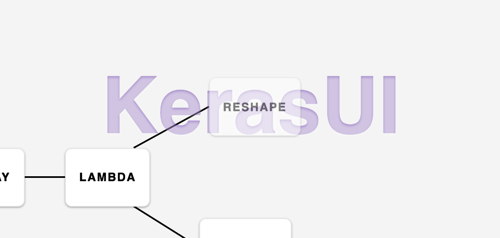

# keras-ui
Visualize and build Keras Models

Built with React & Redux. Layout with dagre. Drag-and-drop with React-Dnd.

Todo:
 * Refactor with MobX
 * Export model functionality
 * Hook up to backend running Keras
